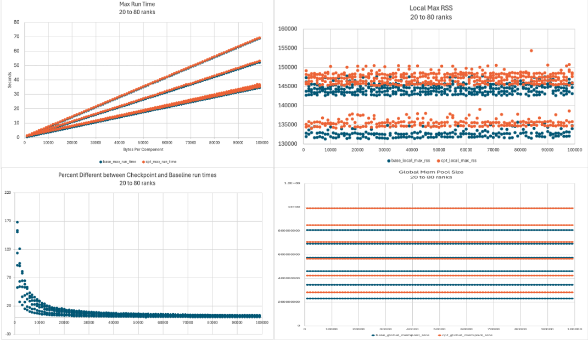

# sst-bench

## Getting Started

The *sst-bench* infrastructure contains a set of specifically crafted 
SST components, subcomponents, links and associated APIs designed to 
exercise specific aspects of the Structural Simulation Toolkit.  The current 
set of benchmarks includes:

* *msg-perf* : Tests the performance of sending incrementally sized messages 
over `simpleNetwork` links in a ring-network pattern.
* *micro-comp* : Tests the performance of loading a large number of small components 
using the various loading methodologies
* *micro-comp-link* : Similar to `micro-comp` but adds in link configuration with 
a single link per component that utilizes SimpleNetwork.  Tests the loading 
of large numbers of components with the default SST partitioner.
* *chkpnt* : Tests the performance of the checkpoint/restart functionality 
present in SST-14.0.0+.  Note that this test is currently only built when SST 
14.0.0 is detected and can be only run in sequential execution mode.  Threading 
and MPI are not currently supported for checkpoint/restart in SST 14.0.0.
* *restore* : Tests the storing and loading of well-defined simulation component data using 
the SST 14.0.0 checkpoint/restart functionality
* *restart* : Sanity checks data after a context restore operation using the 
SST 14.0.0 checkpoint/restart functionality
* *large-stat* : Tests the creation of instantiation of a variable number of unsigned 
64bit statistics for very simple components.  Designed to test large blocks of 
statistics values for simple components.
* *grid* : Generates a configurable 2 dimensional grid network with configurable component and data transfer parameters. Compile options are provided for testing different container data types for evaluating checkpointing performance. 
* *noodle* : Generates randomly connected components using a configurable number of 
ports per component and randomly sends a configurable number of message payloads per cycle.
* *spaghetti* : Generates randomly connected components using a configurable number of 
ports per component and randomly sends messages to adjacent components.  Similar to *noodle*, but utilizes 
event handlers only, none of the components are clocked.
* *hpe-phold* : Port of PHOLD benchmark from https://github.com/hpc-ai-adv-dev/sst-benchmarks based on Fujimoto's 1990 paper [Performance of Time Warp Under Synthetic Workloads](https://gdo149.llnl.gov/attachments/20776356/24674621.pdf).

## Detailed Benchmark Descriptions

### msg-perf
### micro-comp
*micro-comp* is designed to represent the smallest possible clocked component model.  There are no 
subcomponents, ports or unnecessary variables required for serialization in this component.  The goal 
of the *micro-comp* component is to provide a baseline to experiement with model loading performance 
and memory footprint under strictly controlled conditions.  Note that executing *micro-comp* simulations 
will only execute for a single clock cycle.  The only events generated will be the singular clock event 
per component.

#### Parameters
| Parameter  | Description | Values | Default |
|------------|-------------|--------|---------|
| verbose    | Sets the verbosity level | Integer  |  0 |

#### Ports
| Port Name | Description | Library |
|------------|-------------|--------|
| *none* | | |

#### Statistics
| Stat Name | Description | Values |
|------------|-------------|--------|
| *none* | | |

#### Subcomponent Slots
| Slot Name | Description | Library |
|------------|-------------|--------|
| *none* | | |

### micro-comp-link
*micro-comp-link* borrows the core component functionality from *micro-comp*.  However, this version 
adds a subcomponent slot that contains a network interface controller (NIC) based upon the existing 
sst-elements `SimpleNetwork`.  This allows us to construct arbitrarily complex network topologies 
withe *micro-comp*-style endpoints.  The goal with this component configuration is similar to *micro-comp*, 
but it does allow us to 1) experiment with sample topology configurations that are initialized during the init 
phase and 2) experiment with model loading/partitioning in a strictly controlled environment.  The *micro-comp-link* 
simulation component only exists for a single clock cycle and is *not* currently checkpointable.  

#### Parameters
| Parameter  | Description | Values | Default |
|------------|-------------|--------|---------|
| verbose    | Sets the verbosity level | Integer  |  0 |
| clock      | Sets the clock frequency | UnitAlgebra |  1GHz |

#### Ports
| Port Name | Description | Library |
|------------|-------------|--------|
| *none* | | |

#### Statistics
| Stat Name | Description | Values |
|------------|-------------|--------|
| *none* | | |

#### Subcomponent Slots
| Slot Name | Description | Library |
|------------|-------------|--------|
| nic | Network Interface | SST::MicroCompLink::MicroCompLinkNIC |

#### Subcomponent Parameters
| Parameter  | Description | Values | Default |
|------------|-------------|--------|---------|
| clock      | Sets the NIC clock frequency | UnitALgebra |  1GHz |
| port       | Port to use if loaded anonymously | simpleNetworkExample.nicEvent | network |
| verbose    | Sets the verbosity level | Integer  |  0 |

#### Subcomponent Ports
| Port Name | Description | Library |
|------------|-------------|--------|
| iface | SimpleNetwork interface to a network | SST::Interfaces::SimpleNetwork |


### chkpnt

The *chkpnt* component is designed to provide a known baseline for testing checkpoint 
performance on SST 15.0+.  The component contains a set of serialized data elements, port 
configurations and propogating events that exercise the main function of the base SST 
serialization and checkpoint features.  The *chkpnt* component is initialized 
with a number of external facing ports, all of which need to be connected to adjacent 
components.  These ports do not rely upon any existing sst-element components.  The component 
executes for a fixed number of clock cycles and initiates event data sends to all connected 
ports using a user-defined *clockDelay*.  On each sending cycle, the component chooses a random 
number of 64 bit values between *minData* and *maxData* and seeds these integers with random data.  
The entire payload is then sent across the link.  Each payload for each port on each sending cycle 
will be different, thus exercising a large degree of randomness in serializing outstanding events.  The 
component uses a known seed as input from the user, so the component can be executed with the same set of known 
values for reproducibility.

#### Parameters
| Parameter  | Description | Values | Default |
|------------|-------------|--------|---------|
| verbose    | Sets the verbosity level | Integer  |  0 |
| numPorts   | Sets the number of external ports | Integer | 1 |
| minData    | Minimum number of unsigned values | Integer | 1 |
| maxData    | Maximum number of unsigned values | Integer | 2 |
| clockDelay | Clock delay between sends | Integer | 1 |
| clocks     | Clock cycles to execute   | Integer | 1000 |
| rngSeed    | Mersenne RNG Seed | Integer | 1223 |
| clockFreq  | Sets the clock frequency | UnitAlgebra |  1GHz |

#### Ports
| Port Name | Description | Library |
|------------|-------------|--------|
| port%(num_ports)d | Ports which connect to endpoints | chkpnt.ChkpntEvent |

#### Statistics
| Stat Name | Description | Values |
|------------|-------------|--------|
| *none* | | |

#### Subcomponent Slots
| Slot Name | Description | Library |
|------------|-------------|--------|
| *none* | | |

### restore

The *restore* component is designed to exercise the checkpoint + restart functionality in the SST core.  
The component supports serialization of internal data structures in 4 byte increments as defined by the 
*numBytes* parameter.  The user executes the simulation with a pre-defined number of total clock cycles 
(*clocks*) and incrementally checkpoints the component.  The component can then be restarted and the internal 
values can be verified as being correct.  The component utilizes a predefined random number seed such that 
execution is reproducible across simuations.  The goal of this component is to test the restore performance 
using a static number of internal bytes stored in a checkpoint payload.

#### Parameters
| Parameter  | Description | Values | Default |
|------------|-------------|--------|---------|
| verbose    | Sets the verbosity level | Integer  |  0 |
| numBytes   | Sets the number of stored bytes (4 byte increments) | Unit Algebra | 64KB |
| clocks     | Clock cycles to execute   | Integer | 1000 |
| rngSeed    | Mersenne RNG Seed | Integer | 1223 |
| clockFreq  | Sets the clock frequency | UnitAlgebra |  1GHz |

#### Ports
| Port Name | Description | Library |
|------------|-------------|--------|
| *none* | | |

#### Statistics
| Stat Name | Description | Values |
|------------|-------------|--------|
| *none* | | |

#### Subcomponent Slots
| Slot Name | Description | Library |
|------------|-------------|--------|
| *none* | | |

### restart

The *restart* component is very similar to the *restore* component.  The user 
specifies the number of bytes to store in an internal data structure that are seeded 
using a known (*baseSeed*) random number seed.  However, for each clock cycle, the *restart* 
component verifies that the internal data structure contains the correct values element by element.  
This ensures that the data is restored is correct regardless of the checkpoint/restart timing.

#### Parameters
| Parameter  | Description | Values | Default |
|------------|-------------|--------|---------|
| verbose    | Sets the verbosity level | Integer  |  0 |
| numBytes   | Sets the number of stored bytes (4 byte increments) | Unit Algebra | 64KB |
| clocks     | Clock cycles to execute   | Integer | 1000 |
| baseSeed   | Base Mersenne RNG Seed | Integer | 1223 |
| clockFreq  | Sets the clock frequency | UnitAlgebra |  1GHz |

#### Ports
| Port Name | Description | Library |
|------------|-------------|--------|
| *none* | | |

#### Statistics
| Stat Name | Description | Values |
|------------|-------------|--------|
| *none* | | |

#### Subcomponent Slots
| Slot Name | Description | Library |
|------------|-------------|--------|
| *none* | | |

### large-stat

The *large-stat* component is designed to examine the memory overhead of creating very large sets of 
components.  The component is designed to execute for a single clock cycle with no interchanging events.  
Upon startup, the component creates a user-defined number of unsigned 64 bit statistics in the form: 
*STAT_n* where `n` is a monotonically increasing integer.  Users should execute this component with SST 
verbosity enabled and/or profiling in order to trace the amount of virtual memory utilized.

#### Parameters
| Parameter  | Description | Values | Default |
|------------|-------------|--------|---------|
| verbose    | Sets the verbosity level | Integer  |  0 |
| numStats   | Sets the number of stats to create | Integer |  1 |

#### Ports
| Port Name | Description | Library |
|------------|-------------|--------|
| *none* | | |

#### Statistics
| Stat Name | Description | Values |
|------------|-------------|--------|
| STAT_ | Basic stat handler | count |

#### Subcomponent Slots
| Slot Name | Description | Library |
|------------|-------------|--------|
| *none* | | |

### grid
### noodle
### spaghetti
### hpe-phold

## Parameter Sweep Automation

A structured methodology to define, manage, and analyze parameter sweep simulations is provided along with sample scripts.
These support running simulations locally on a development system or through the `slurm` batch management system. Example charts generated using this system are shown below. Refer to the [documentation](documentation/README.md) for more information.





## Prerequisites

Given that this is an SST external component, the primary prerequisite is a current installation of the SST Core. Some microbenchmarks use components from SST Elements so it is recommended to install that as well. These test case are labeled 'elements' so they can easily be excluded from testing.  The sst-bench building infrastructure assumes that the `sst-config` tool is installed and can be found in the current PATH environment.

*sst-bench* relies upon CMake for building the component source.  The minimum 
required version for this is `3.19`

## Building

Building the *sst-bench* infrastructure from source can be performed 
using the following steps:

```
git clone https://github.com/tactcomplabs/sst-bench.git
cd sst-bench
mkdir build
cd build
cmake ../
make && make install
```

Additional build options include:
* `make uninstall` : forcible uninstalls the included components/subcomponents 
from the current version of SST
* `cmake -DSSTBENCH_ENABLE_TESTING=ON ../` : Enables included test harness: 
run with `make test`

## Testing

Utilize the included test harness to test and ensure all tests are passing 
before opening new pull requests.  The test harness can be enabled when 
you run the CMake configuration step as follows:

```
cmake -DSSTBENCH_ENABLE_TESTING=ON ../
make -j
make install
make test
```
If SST Elements is not installed, the dependent tests can be excluded using:
```
ctest -LE elements
```

A special set of long tests that may create extremely large files and can be excluded using:
```
ctest -LE large
```

Currently, the checkpoint tests may generate a large number of files. To clean up after running tests use
```
cd ..
git clean -f -d
```

## Special Runtime Notes

### Benchmark Scale
Be mindful of the simulation input size when scaling tests near the limits of physical memory or compute capacity.  Several benchmarks exhibit exponential memory growth.


## Contributing

We welcome outside contributions from corporate, academic and individual
developers. However, there are a number of fundamental ground rules that you
must adhere to in order to participate. These rules are outlined as follows:

* By contributing to this code, one must agree to the licensing described in
the top-level [LICENSE](LICENSE) file.
* All code must adhere to the existing C++ coding style. While we are somewhat
flexible in basic style, you will adhere to what is currently in place. This
includes camel case C++ methods and inline comments. Uncommented, complicated
algorithmic constructs will be rejected.
* We support compilaton and adherence to C++ standard methods. All new methods
and variables contained within public, private and protected class methods must
be commented using the existing Doxygen-style formatting. All new classes must
also include Doxygen blocks in the new header files. Any pull requests that
lack these features will be rejected.
* All changes to functionality and the API infrastructure must be accompanied
by complementary tests All external pull requests **must** target the `devel`
branch. No external pull requests will be accepted to the master branch.
* All external pull requests must contain sufficient documentation in the pull
request comments in order to be accepted.

## License

See the [LICENSE](./LICENSE) file

## Authors
* John Leidel
* Ken Griesser
* Shannon Kuntz
