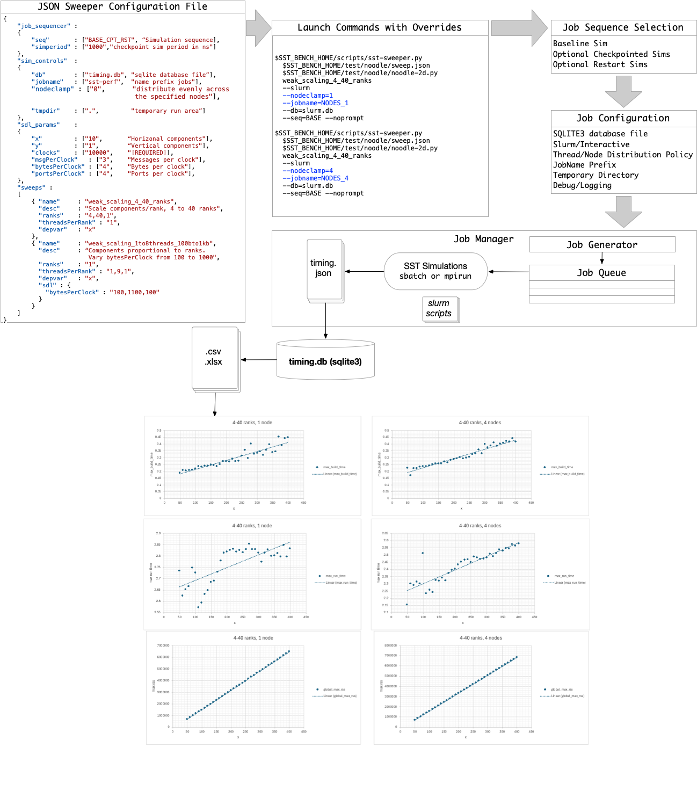

# SST-Bench Examples

## Overview



## System Requirements

These examples demonstrate scripts that support simulation job management and performance data capture for systems supporting MPI with or without Slurm support. That is, if Slurm support is not available, a built-in job manager is provided that allows launching and monitoring parameter sweep simulations.

These scripts have been tested on the following Operating Systems:

- Darwin Kernel Version 25.3.0 arm64
- Linux 4.18.0-477.10.1.el8_8.x86_64
- Linux 6.8.0-101-generic Ubuntu x86_64

Additional packages:
- python3
- python3 sqlite3 module
- sqlite3
- slurm (optional)

## SST Requirements

The minimum required version of sst is `v15.1.0`.

## Environment Variables

The following environment variable is required:

```
export SST_BENCH_HOME=<path-to-sstbench>
```

## Running Simulations: General tips

If you are running on a system using `slurm` job management you can still run MPI simulations interactively. Be sure to allocate the necessary compute resource using `salloc -N <nodes> -n <processors>`

Generally, the scripts should be run on a fast local disk rather than on NFS as disk latencies have a major impact on performance. This is especially true when running with checkpointing and restarting from checkpoints which have high disk usage.

## JSON Sweeper Configuration Example

```
{
    "job_sequencer" :
    {
        "seq"       : ["BASE_CPT_RST", "Select simulation sequence: BASE|BASE_CPT|BASE_CPT_RST"],
        "simperiod" : ["1000",        "checkpoint sim period in ns"]
    },
    "sim_controls"  :
    {
        "db"        : ["timing.db", "sqlite database file to be created or updated"],
        "jobname"   : ["sst-perf",  "name associated with all jobs"],
        "nodeclamp" : ["0",         "distribute threads evenly across specified number of nodes"],
        "tmpdir"    : [".",         "temporary area for running jobs"]
    },
    "sst_params"    :
    {
        "add-lib-path"  : "${SST_BENCH_HOME}/components/noodle"
    },
    "sdl_params"    :
    {
        "x"             : ["10",        "Number of horizonal components"],
        "y"             : ["1",         "Number of vertical components"],
        "rngSeed"       : ["0",         "Random number generator seed"],
        "clocks"        : ["10000",    "[REQUIRED] Number of clocks to run sim"],
        "clockFreq"     : ["1",         "Clock Frequency in GHz"],
        "msgPerClock"   : ["3",         "Messages per clock"],
        "bytesPerClock" : ["4",         "Bytes per clock"],
        "portsPerClock" : ["4",         "Ports per clock"],
        "verbose"       : ["0",         "verbosity level"]
    },
    "sweeps" :
    [
        { "name"     : "sanity",
          "desc"     : "Basic check of a short simulation sequence",
          "ranks"    : "1",
          "threadsPerRank" : "1"
        },
        { "name"     : "sweep-sanity",
          "desc"     : "2-3 threads, dependent bytesPerClock, 10-15 components",
          "ranks"    : "1",
          "threadsPerRank" : "2,4,1",
          "depvar"   : "bytesPerClock",
          "sdl"      :
          {
            "x" : "10,20,5"
          }
        },
        { "name"     : "thread-sanity",
          "desc"     : "Basic check of a short simulation sequence",
          "ranks"    : "1",
          "threadsPerRank" : "1,9,2"
        },
        { "name"     : "rank-sanity",
          "desc"     : "Basic check of a short simulation sequence",
          "ranks"    : "1,9,2",
          "threadsPerRank" : "1"
        },
        { "name"     : "weak_scaling_short",
          "desc"     : "Maintain the number of components proportional to the number of ranks plus threads",
          "ranks"    : "1,9,1",
          "threadsPerRank" : "1",
          "depvar"   : "x"
        },
        { "name"     : "weak_scaling_4_40_ranks",
          "desc"     : "Scale components/rank, 4 to 40 ranks",
          "ranks"    : "4,40,1",
          "threadsPerRank" : "1",
          "depvar"   : "x"
        },
        { "name"     : "size_rank_perm",
          "desc"     : "Permute comp size and ranks for a fixed number of components",
          "ranks"    : "2,9,2",
          "threadsPerRank" : "1",
          "sdl"      : 
          { 
            "x"  : "100,1100,100"
          }
        },
        { "name"     : "messages_rank_perm",
          "desc"     : "Permute msgPerClock and ranks for a fixed number of components",
          "ranks"    : "2,9,2",
          "threadsPerRank" : "1",
          "sdl" :
          {
            "msgPerClock" : "10,110,10"
          }
        },
        { "name"     : "weak_scaling_1to8ranks_100bto1kb",
          "desc"     : "Maintain component count proportional to number of ranks. Vary bytesPerClock from 100 to 1000 bytes",
          "ranks"    : "1,9,1",
          "threadsPerRank" : "1",
          "depvar"   : "x",
          "sdl" : {
            "bytesPerClock" : "100,1100,100"
          }
        }
    ]
}
```

## sst-sweeper.py

The basic command is:

```
$ $SST_BENCH_HOME/scripts/sst-sweeper.py --help
usage: sst-sweeper.py jsonFile sdlFile sweep [options] [overrides]
       sst-sweeper.py --help <path-to-jsonFile>

SST Simulation parameter sweeps with performance database generation

positional arguments:
  jsonFile              JSON sweeper configuration file
  sdlFile               Python SST configuration file
  sweep                 Name of sweep from jsonFile 

options:
  -h, --help            show this help message and exit
  --logging             print logging messages
  --noprompt            do not prompt user to confirm launching jobs
  --norun               print job commands but do not run
  --slurm               launch slurm jobs instead of using local mpirun

job sequencer overrides:
  --seq {BASE,BASE_CPT,BASE_CPT_RST}
                        Select simulation sequence 
  --simperiod SIMPERIOD
                        checkpoint simulation period in ns 

sim control overrides:
  --db DB               sqlite database file to be created or updated 
  --jobname JOBNAME     name associated with all jobs 
  --tmpdir TMPDIR       temporary area for running jobs 
  --nodeclamp NODECLAMP
                        distribute threads evenly across specified nodes 

Use "--help <path-to-jsonFile>" to include custom configuration command line details (e.g. ./sst-sweeper.py --help sweep.json)
```

Using the JSON Sweeper Configuration file, the command is customized:

```
$ ./scripts/sst-sweeper.py $SST_BENCH_HOME/test/noodle/sweep.json --help
usage: sst-sweeper.py jsonFile sdlFile sweep [options] [overrides]
       sst-sweeper.py --help <path-to-jsonFile>

SST Simulation parameter sweeps with performance database generation

positional arguments:
  jsonFile              JSON sweeper configuration file
  sdlFile               Python SST configuration file
  sweep                 Name of sweep from jsonFile 
                        sanity, sweep-sanity, thread-sanity, rank-sanity, weak_scaling_short, weak_scaling_4_40_ranks, size_rank_perm, messages_rank_perm, weak_scaling_1to8ranks_100bto1kb, weak_scaling_1to8threads_100bto1kb

options:
  -h, --help            show this help message and exit
  --logging             print logging messages
  --noprompt            do not prompt user to confirm launching jobs
  --norun               print job commands but do not run
  --slurm               launch slurm jobs instead of using local mpirun

job sequencer overrides:
  --seq {BASE,BASE_CPT,BASE_CPT_RST}
                        Select simulation sequence [BASE_CPT_RST]
  --simperiod SIMPERIOD
                        checkpoint simulation period in ns [1000]

sim control overrides:
  --db DB               sqlite database file to be created or updated [timing.db]
  --jobname JOBNAME     name associated with all jobs [sst-perf]
  --tmpdir TMPDIR       temporary area for running jobs [.]
  --nodeclamp NODECLAMP
                        distribute threads evenly across specified nodes [0]

sdl overrides:
  --x X                 Number of horizonal components [10]
  --y Y                 Number of vertical components [1]
  --rngSeed RNGSEED     Random number generator seed [0]
  --clocks CLOCKS       [REQUIRED] Number of clocks to run sim [10000]
  --clockFreq CLOCKFREQ
                        Clock Frequency in GHz [1]
  --msgPerClock MSGPERCLOCK
                        Messages per clock [3]
  --bytesPerClock BYTESPERCLOCK
                        Bytes per clock [4]
  --portsPerClock PORTSPERCLOCK
                        Ports per clock [4]
  --verbose VERBOSE     verbosity level [0]

sst overrides:
  --add-lib-path ADD_LIB_PATH
                        ['/Users/kgriesser/work/sst-bench/components/noodle']

Available sweeps [10]
  sanity
  --desc: Basic check of a short simulation sequence
  --ranks: 1
  --threadsPerRank: 1
  sweep-sanity
  --desc: 2-3 threads, dependent bytesPerClock, 10-15 components
  --ranks: 1
  --threadsPerRank: 2,4,1
  --depvar: bytesPerClock
  --sdl:
    --x: 10,20,5
  thread-sanity
  --desc: Basic check of a short simulation sequence
  --ranks: 1
  --threadsPerRank: 1,9,2
  rank-sanity
  --desc: Basic check of a short simulation sequence
  --ranks: 1,9,2
  --threadsPerRank: 1
  weak_scaling_short
  --desc: Maintain the number of components proportional to the number of ranks plus threads
  --ranks: 1,9,1
  --threadsPerRank: 1
  --depvar: x
  weak_scaling_4_40_ranks
  --desc: Scale components/rank, 4 to 40 ranks
  --ranks: 4,40,1
  --threadsPerRank: 1
  --depvar: x
  size_rank_perm
  --desc: Permute comp size and ranks for a fixed number of components
  --ranks: 2,9,2
  --threadsPerRank: 1
  --sdl:
    --x: 100,1100,100
  messages_rank_perm
  --desc: Permute msgPerClock and ranks for a fixed number of components
  --ranks: 2,9,2
  --threadsPerRank: 1
  --sdl:
    --msgPerClock: 10,110,10
  weak_scaling_1to8ranks_100bto1kb
  --desc: Maintain component count proportional to number of ranks. Vary bytesPerClock from 100 to 1000 bytes
  --ranks: 1,9,1
  --threadsPerRank: 1
  --depvar: x
  --sdl:
    --bytesPerClock: 100,1100,100
  weak_scaling_1to8threads_100bto1kb
  --desc: Maintain component count proportional to number of ranks. Vary bytesPerClock from 100 to 1000 bytes
  --ranks: 1
  --threadsPerRank: 1,9,1
  --depvar: x
  --sdl:
    --bytesPerClock: 100,1100,100
  ```

## Command Line Examples

These examples run a weak scaling test from 4 to 40 ranks. The first is run on 
a single node. The second distributes the processes evenly across 4 nodes.

```
$SST_BENCH_HOME/scripts/sst-sweeper.py
  $SST_BENCH_HOME/test/noodle/sweep.json
  $SST_BENCH_HOME/test/noodle/noodle-2d.py
  weak_scaling_4_40_ranks 
  --slurm 
  --nodeclamp=1 
  --jobname=NODES_1
  --db=slurm.db 
  --seq=BASE --noprompt

$SST_BENCH_HOME/scripts/sst-sweeper.py
  $SST_BENCH_HOME/test/noodle/sweep.json
  $SST_BENCH_HOME/test/noodle/noodle-2d.py
  weak_scaling_4_40_ranks 
  --slurm 
  --nodeclamp=4 
  --jobname=NODES_4
  --db=slurm.db 
  --seq=BASE --noprompt
```

## Example Scripts

These scripts demonstrate how to launch jobs and generate CSV files from the sqlite3 database file.

```
  cd $SST_BENCH_HOME/test/noodle
  # review sweep.json
  cat sweep.json
  # run local examples
  ./run-local.sh
  ./run-cptrst-local.sh
  # run slurm examples
  ./run-slurm.sh
  ./run-cptrst-slurm.sh
```
