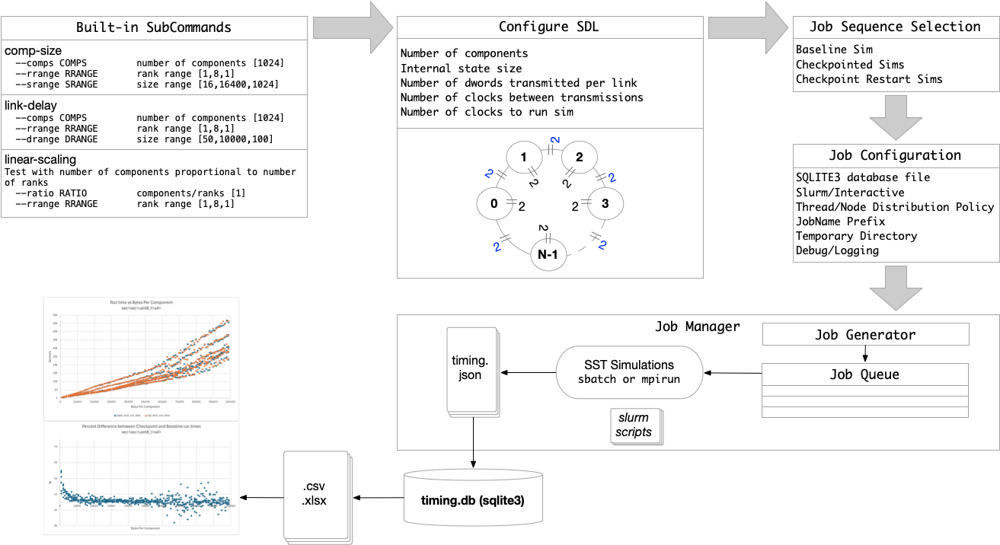
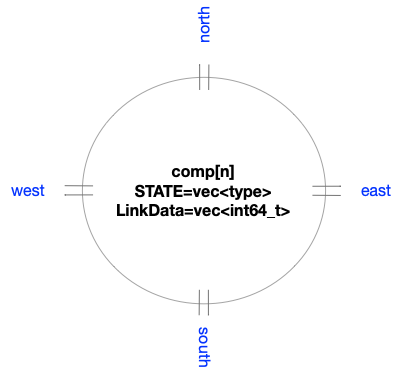
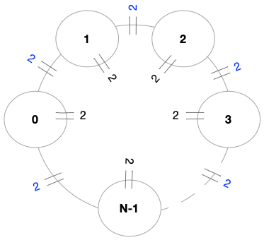

# SST-Bench Examples

## Overview



## System Requirements

These examples demonstrate scripts that support simulation job management and performance data capture for systems supporting MPI with or without Slurm support. That is, if Slurm support is not available, a built-in job manager is provided that allows launching and monitoring parameter sweep simulations.

These scripts have been tested on the following Operating Systems:

- Linux 6.8.0-60-generic #63-Ubuntu SMP PREEMPT_DYNAMIC Tue Apr 15 19:04:15 UTC 2025 x86_64 x86_64 x86_64 GNU/Linux

- Linux 4.18.0-477.10.1.el8_8.x86_64 #1 SMP Tue May 16 11:38:37 UTC 2023 x86_64 x86_64 x86_64 GNU/Linux

- Darwin 24.5.0 Darwin Kernel Version 24.5.0: Tue Apr 22 19:54:25 PDT 2025; root:xnu-11417.121.6~2/RELEASE_ARM64_T6020 arm64


## SST Requirements
Currently, these examples require a custom branch of `sst-core` to provide simulation timing data in JSON format. This feature is expected to be available in SST v15.1.0. 

Installing `sst-core/v15.0.0.tcl` from TCL's github:
```
git clone https://github.com/tactcomplabs/sst-core
cd sst-core
git checkout v15.0.0.tcl
./autogen.sh
mkdir build && cd build
../configure --prefix=<sst-install-dir>
make -j -s && make install
```

Be sure to update your `PATH` environment variable to include `<sst-install-dir>/bin`.

Installation of sst-elements is optional. If it is installed be sure to use the compatable `v15.0.0_beta` branch.

Finally, clean and rebuild `sst-bench` using this version of SST following the instructions in the top level README.md.
To test sst-bench without sst-elements installed use `ctest -LE elements`

## Environment Variables

The following environment variable is required:

```
export SST_BENCH_HOME=<path-to-sstbench>
```

## Running Simulations: General tips

If you are running on a system using Slurm job management you can still run MPI simulations interactively. Be sure to allocate the necessary compute resource using `salloc -N <nodes> -n <processors>`

Generally, the scripts should be run on a fast local disk rather than on NFS as disk latencies have a major impact on performance. This is especially true when running with checkpointing and restarting from checkpoints which have high disk usage.

For example, if there exist a local disk `/scratch/$USER`, copy the example directory to that disk and run the scripts from there. e.g.

```
export SST_BENCH_HOME=<path-to-sst-bench>
# salloc is optional depending on the host platform policy
salloc -N 1 -n 40  
cd /scratch/$USER
mkdir sst-bench-data && cd sst-bench-data
mkdir run1 && cd run1
cp $SST_BENCH_HOME/examples/comp-size.sh
# Modify the local copy of the script to customize behaviors
./comp-size.sh 
```

When using the slurm job manager, the scripts currently require support for the `sacct` command. This may be an issue for some users so the scripts will be modified to detect the presence of this command before attempting to collect these statistics.

## Example 1: comp-size.sh (interactive)

Setup:

```
# components        10                          # Number of components
# link_delay        10000,11000 (random)        # Delay between link transmissions
# clocks            10000                       # Number of clocks to simulate
# cpt-sim-period     5000                       # Number of clocks between checkpoints

# Parameter sweep variables set with sst_perfdb command line
# srange    1000 to 11000 step 5000     # Number of state elements per component
# rrange    2 to 8 step 2               # Sweep of ranks
```

To run:
```
$ mkdir run1 && cd run1
$ cp $SST_BENCH_HOME/examples/comp-size.sh
# Modify the local copy of the script to customize behaviors
$ ./comp-size.sh 
```

The jobs will be run serially to permute the component state size and number of ranks. Each job will be run without checkpointing, with checkpointing enabled, and restarting from each checkpoint. 

Results:
```
$ ls
alldata.csv  basecpt.csv  base.csv  comp-size-mpi/  comp-size.sh*  cpt.csv  cptrst.csv  host.info  rst.csv  timing.db
```
The file `timing.db` is an sqlite3 data base file. 
The `.csv` files are generated using the scripts under `examples/sql`.

```
$ tree comp-size-mpi 
comp-size-mpi
├── 381208231936      # baseline simulation without checkpointing
│   ├── config.json
│   ├── log
│   └── timing.json
├── 381208231937      # simulation with checkpointing
│   ├── config.json
│   ├── _cpt
│   │   ├── 1_5000000
│   │   │   ├── grid_0_0.bin
│   │   │   ├── grid_1_0.bin
│   │   │   ├── grid_globals.bin
│   │   │   └── grid.sstcpt
│   │   └── 2_10000000
│   │       ├── grid_0_0.bin
│   │       ├── grid_1_0.bin
│   │       ├── grid_globals.bin
│   │       └── grid.sstcpt
│   ├── log
│   └── timing.json
├── 381208231938     # simulations restarting from checkpoint
│   ├── log
│   └── timing.json
├── 381208231939     # next simulation restarting from checkpoint
│   ├── log
│   └── timing.json
├── 381208231940     # Next baseline simulation
│   ├── config.json
│   ├── log
│   └── timing.json
├── 381208231941
│   ├── config.json
│   ├── _cpt
│   │   ├── 1_5000000
│   │   │   ├── grid_0_0.bin
│   │   │   ├── grid_1_0.bin
│   │   │   ├── grid_2_0.bin
│   │   │   ├── grid_3_0.bin
│   │   │   ├── grid_globals.bin
│   │   │   └── grid.sstcpt
│   │   └── 2_10000000
│   │       ├── grid_0_0.bin
│   │       ├── grid_1_0.bin
│   │       ├── grid_2_0.bin
│   │       ├── grid_3_0.bin
│   │       ├── grid_globals.bin
│   │       └── grid.sstcpt
│   ├── log
│   └── timing.json
| ... etc...
```

## Example 2: comp-size.sh (slurm)

Create another run directory and copy the same script as Example 1.
This is run from the management node so no need to perform `salloc`.

```
mkdir run2 && cd run2
cp $SST_BENCH_HOME/examples/comp-size.sh .
```

Edit `comp-size.sh` to uncomment the SLURM variable

```
# Uncomment to use slurm job scripts                                                       
SLURM="--slurm"
```

Launch the script
```
./comp-size.sh
```

This will run the same jobs as in example 1 but using `sbatch` commands instead of `mpirun` commands.

Results:
```
$ ls 
alldata.csv     rst.csv          slurm-46372.out  slurm-46381.out  slurm-46390.out  slurm-46399.out
basecpt.csv     slurm-46364.out  slurm-46373.out  slurm-46382.out  slurm-46391.out  slurm-46400.out
base.csv        slurm-46365.out  slurm-46374.out  slurm-46383.out  slurm-46392.out  slurm-46401.out
comp-size-mpi/  slurm-46366.out  slurm-46375.out  slurm-46384.out  slurm-46393.out  slurm-46402.out
comp-size.sh*   slurm-46367.out  slurm-46376.out  slurm-46385.out  slurm-46394.out  slurm-46403.out
cpt.csv         slurm-46368.out  slurm-46377.out  slurm-46386.out  slurm-46395.out  timing.db
cptrst.csv      slurm-46369.out  slurm-46378.out  slurm-46387.out  slurm-46396.out
host.info       slurm-46370.out  slurm-46379.out  slurm-46388.out  slurm-46397.out
log             slurm-46371.out  slurm-46380.out  slurm-46389.out  slurm-46398.out
```

The file `timing.db` is an sqlite3 data base file. 
The `.csv` files are generated using the scripts under `examples/sql`.

```
$ tree comp-size-mpi
comp-size-mpi
├── 46364                             # baseline simulation
│   ├── config.json
│   ├── log
│   ├── slurm.json
│   └── timing.json
├── 46365                             # simulation with checkpointing
│   ├── config.json
│   ├── _cpt
│   │   ├── 1_5000000
│   │   │   ├── grid_0_0.bin
│   │   │   ├── grid_1_0.bin
│   │   │   ├── grid_globals.bin
│   │   │   └── grid.sstcpt
│   │   └── 2_10000000
│   │       ├── grid_0_0.bin
│   │       ├── grid_1_0.bin
│   │       ├── grid_globals.bin
│   │       └── grid.sstcpt
│   ├── log
│   ├── slurm.json
│   └── timing.json
├── 46366                             # restart from checkpoint
│   ├── log
│   ├── slurm.json
│   └── timing.json
├── 46367                             # restart from checkpoint
│   ├── log
│   ├── slurm.json
│   └── timing.json
├── 46369                             # completion job to read slurm statistics using sacct command
│   ├── config.json
│   ├── log
│   ├── slurm.json
│   └── timing.json
├── 46370                             # the next baseline simulation
```

## List of parameter sweep scripts

All of the scripts listed below are run the same way as the previous examples but provide different parameter sweep features.
The bash scripts are intended to be easy to modify. Foundational Python3 scripts commands provide `--help` option for more information on controlling the grid simulation.

-   comp-size.sh        Vary the size of the component and the number or ranks
-   link-delay.sh       Vary the number of clocks between data transfers of links and the number of ranks
-   linear-scaling.sh    Vary the ratio of components per rank and the number of ranks

## Slurm considerations

The  following slurm scripts, located in `$SST_BENCH_HOME/scripts` will need to be customized for the target system.
```
perf.slurm
completion.slurm
```

## SDL: 2d.py

The system under test is provided by `$SST_BENCH_HOME/test/grid/2d.py`. Currently there is no option to override this.

This SDL provides a flexible system where the user can control the number of components, the size of the data managed by each component, the frequency of link transmissions, and the size of the data transmitted.  Additional checking is performance on the internal data to ensure checkpoint restart is functioning correctly.



This system is realized as a configurable 2D mesh network with multiple links connecting nodes. Links at the end of rows and columns wrap around to the first element of the corresonding row or column. A typical use is to create a simple toroid by setting the number of rows to 1. The number of columns will then represent the total number of components as shown below.



The specific controls provided by the SDL are described in the built-in help.

```
$ sst 2d.py -- --help
usage: sstsim.x [-h] [--x X] [--y Y] [--numBytes NUMBYTES] [--minData MINDATA] [--maxData MAXDATA] [--clocks CLOCKS] [--minDelay MINDELAY] [--maxDelay MAXDELAY] [--rngSeed RNGSEED]
                [--demoBug DEMOBUG] [--verbose VERBOSE]

2d grid network test 1 with checkpoint/restart checks

options:
  -h, --help           show this help message and exit
  --x X                number of horizonal components
  --y Y                number of vertical components
  --numBytes NUMBYTES  Internal state size (4 byte increments)
  --minData MINDATA    Minimum number of dwords transmitted per link
  --maxData MAXDATA    Maximum number of dwords transmitted per link
  --clocks CLOCKS      number of clocks to run sim
  --minDelay MINDELAY  min number of clocks between transmissions
  --maxDelay MAXDELAY  max number of clocks between transmissions
  --rngSeed RNGSEED    seed for random number generator
  --verbose VERBOSE    verbosity level
```

## Parameter Sweep Script: sst-perfdb.py

The example scripts all utilize `$SST_BENCH_HOME/scripts/sst-perfdb.py` which manages the parameter sweep jobs and aggregates simulation results into a `sqlite3` file. It is intended to be extremely general and modular but currently it is tied closely to the SDL, `$SST_BENCH_HOME/test/grid/2d.py`.

Additional features of `sst-perfdb.py` include:

- A single front-end to launch mpirun or slurm based parameter sweep simulations and capture all data in a single persistent sqlite3 file.
- Built-in parameter sweep controls. Because the `sqlite3` file is persistent, scripting can be used to provide additional parameter sweep capabilities.
- A Python3 job utility class that is used to launch locally with mpirun, batching using slurm, or other shell commands.
- A Job manager that queues up jobs, submits them, and gathers performance data.
- JSON and Sqlite3 utilities used to gather data in JSON files and populate a persistent sqlite3 database file.
- Methods to extend performance tests by adding commands to a single Python script which allows extending 'built-in' tests.
- Ability to control how processes are distributed across nodes.
- Built-in in job sequencing for:
    - single simulation with no checkpoints
    - simulation with and without checkpoints
    - simulation with and without checkpoints followed by restarting all checkpointed simulations.
- Job Throttling: Slurm jobs are currently serialized and are limited to a maximum of 4 nodes. (This limit may be relaxed in the future.)

General usage is provided using `sst-perfdb.py --help`.

```
$ sst-perfdb.py --help

usage: sst-perfdb.py [-h] {linear-scaling,comp-size,link-delay} ...

Simulation parameter sweeps and SST performance database generation

options:
  -h, --help            show this help message and exit

subcommands:
  {linear-scaling,comp-size,link-delay}
                        available subcommands. Use {subcommand --help} for more detail
    linear-scaling      Test with number of components proportional to number of ranks
    comp-size           Permute component size and ranks. Fixed number of components
    link-delay          Permute link delay and ranks. Fixed number of components

This script currently requires `v15.0.0.tcl` branch from git@github.com:tactcomplabs/sst-core.git
```

Each subcommand has a custom set of options. Use `sst-perfdb.py <subcommand> --help` for more information.

### Linear Scaling

Test with number of components proportional to number of ranks.

```
$ sst-perfdb.py linear-scaling --help

usage: sst-perfdb.py linear-scaling [-h] [--cpt] [--cptrst] [--simperiod SIMPERIOD] [--clocks CLOCKS] [--numBytes NUMBYTES]
                                    [--minDelay MINDELAY] [--maxDelay MAXDELAY] [--db DB] [--jobname JOBNAME] [--logging]
                                    [--nodeclamp NODECLAMP] [--noprompt] [--norun] [--slurm] [--tmpdir TMPDIR] [--ratio RATIO]
                                    [--rrange RRANGE]

options:
  -h, --help            show this help message and exit
  --ratio RATIO         components/ranks [1]
  --rrange RRANGE       rank range [1,8,1]

job sequence control:
  --cpt                 run baseline and checkpoint simulations
  --cptrst              run baseline, checkpoint, and restart simulations
  --simperiod SIMPERIOD
                        checkpoint simulation period in ns

SDL controls:
  --clocks CLOCKS       sst clock cycles to run [1000000]
  --numBytes NUMBYTES   Size of component state in bytes [16384]
  --minDelay MINDELAY   minimum delay between transfers [50]
  --maxDelay MAXDELAY   maximum delay between transfers [100]

Simulation configuration control:
  --db DB               sqlite database file to be created or updated [timing.db]
  --jobname JOBNAME     name associated with all jobs [sst-perf]
  --logging             print debug logging messages
  --nodeclamp NODECLAMP
                        distribute threads evenly across a fixed number of specified nodes. [0-minimize]
  --noprompt            do not prompt user to confirm launching jobs
  --norun               print job commands but do not run them
  --slurm               launch slurm jobs instead of using local mpirun
  --tmpdir TMPDIR       temporary area for running jobs. [current working directory]
```

### Component Size

Permute component size and ranks. Fixed number of components.

```
$ sst-perfdb.py comp-size --help

usage: sst-perfdb.py comp-size [-h] [--cpt] [--cptrst] [--simperiod SIMPERIOD] [--clocks CLOCKS] [--numBytes NUMBYTES]
                               [--minDelay MINDELAY] [--maxDelay MAXDELAY] [--db DB] [--jobname JOBNAME] [--logging]
                               [--nodeclamp NODECLAMP] [--noprompt] [--norun] [--slurm] [--tmpdir TMPDIR] [--comps COMPS]
                               [--rrange RRANGE] [--srange SRANGE]

options:
  -h, --help            show this help message and exit
  --comps COMPS         number of components [1024]
  --rrange RRANGE       rank range [1,8,1]
  --srange SRANGE       size range [16,16400,1024]

job sequence control:
  --cpt                 run baseline and checkpoint simulations
  --cptrst              run baseline, checkpoint, and restart simulations
  --simperiod SIMPERIOD
                        checkpoint simulation period in ns

SDL controls:
  --clocks CLOCKS       sst clock cycles to run [1000000]
  --numBytes NUMBYTES   Size of component state in bytes [16384]
  --minDelay MINDELAY   minimum delay between transfers [50]
  --maxDelay MAXDELAY   maximum delay between transfers [100]

Simulation configuration control:
  --db DB               sqlite database file to be created or updated [timing.db]
  --jobname JOBNAME     name associated with all jobs [sst-perf]
  --logging             print debug logging messages
  --nodeclamp NODECLAMP
                        distribute threads evenly across a fixed number of specified nodes. [0-minimize]
  --noprompt            do not prompt user to confirm launching jobs
  --norun               print job commands but do not run them
  --slurm               launch slurm jobs instead of using local mpirun
  --tmpdir TMPDIR       temporary area for running jobs. [current working directory]
```

### Link Delay

Permute link delay and ranks. Fixed number of components.

```
$ sst-perfdb.py link-delay --help

usage: sst-perfdb.py link-delay [-h] [--cpt] [--cptrst] [--simperiod SIMPERIOD] [--clocks CLOCKS] [--numBytes NUMBYTES]
                                [--minDelay MINDELAY] [--maxDelay MAXDELAY] [--db DB] [--jobname JOBNAME] [--logging]
                                [--nodeclamp NODECLAMP] [--noprompt] [--norun] [--slurm] [--tmpdir TMPDIR] [--comps COMPS]
                                [--rrange RRANGE] [--drange DRANGE]

options:
  -h, --help            show this help message and exit
  --comps COMPS         number of components [1024]
  --rrange RRANGE       rank range [1,8,1]
  --drange DRANGE       size range [50,10000,100] (maxDelay=minDelay+|step|)

job sequence control:
  --cpt                 run baseline and checkpoint simulations
  --cptrst              run baseline, checkpoint, and restart simulations
  --simperiod SIMPERIOD
                        checkpoint simulation period in ns

SDL controls:
  --clocks CLOCKS       sst clock cycles to run [1000000]
  --numBytes NUMBYTES   Size of component state in bytes [16384]
  --minDelay MINDELAY   minimum delay between transfers [50]
  --maxDelay MAXDELAY   maximum delay between transfers [100]

Simulation configuration control:
  --db DB               sqlite database file to be created or updated [timing.db]
  --jobname JOBNAME     name associated with all jobs [sst-perf]
  --logging             print debug logging messages
  --nodeclamp NODECLAMP
                        distribute threads evenly across a fixed number of specified nodes. [0-minimize]
  --noprompt            do not prompt user to confirm launching jobs
  --norun               print job commands but do not run them
  --slurm               launch slurm jobs instead of using local mpirun
  --tmpdir TMPDIR       temporary area for running jobs. [current working directory]
```

### Performance Considerations

- Use --minDelay and --maxDelay with values > 1000 to achieve better scaling.
- Use --norun option before launching parameter sweep simulations to get a count of the total number of simulations that will be launched.

## Known issues

These issues are planned to be addressed in future releases.

- The SDL is currently hardcoded to $SST_BENCH_HOME/test/grid/2d.py. 
- When using slurm, the host information captured in the database file is for the management node and not the node the simulation is actually run on.