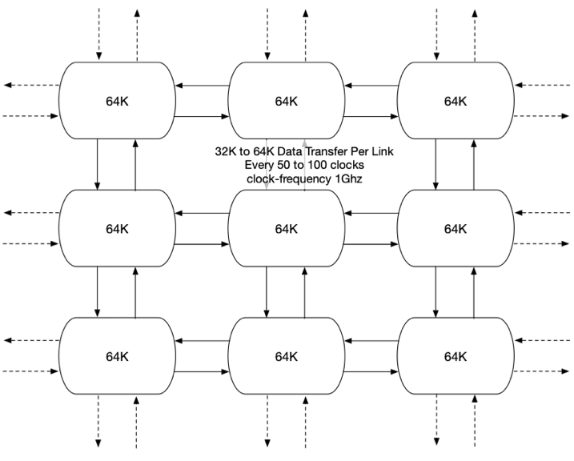

# Grid simulation profiling

## Overview

Grid simulation profiling provides a flexible method to quickly generate large networks that generate and transmit randomized data across adjacent links at random time intervals. Additionally, the transmitted data is unique per link and checked at the reciever. Thus, we provide both functional and performance verification for complex sst simulations.

## SST Configuration
The grid configuration shown below and its sst test driver is defined in the file '2d.py'

    $ sst 2d.py -- --help
    usage: sstsim.x [-h] [--x X] [--y Y] [--numBytes NUMBYTES] [--minData MINDATA] [--maxData MAXDATA] [--clocks CLOCKS] [--minDelay MINDELAY] [--maxDelay MAXDELAY] [--rngSeed RNGSEED]
                    [--demoBug DEMOBUG] [--verbose VERBOSE]

    2d grid network test 1 with checkpoint/restart checks

    options:
      -h, --help           show this help message and exit
      --x X                number of horizonal components
      --y Y                number of vertical components
      --numBytes NUMBYTES  Internal state size (4 byte increments)
      --minData MINDATA    Minimum number of dwords transmitted per link
      --maxData MAXDATA    Maximum number of dwords transmitted per link
      --clocks CLOCKS      number of clocks to run sim
      --minDelay MINDELAY  min number of clocks between transmissions
      --maxDelay MAXDELAY  max number of clocks between transmissions
      --rngSeed RNGSEED    seed for random number generator
      --demoBug DEMOBUG    induce bug for debug demonstration (wip)
      --verbose VERBOSE    verbosity level

## Requirements
- sst v14.1
- python3
- sqlite3

## Simulation Profiling Automation Scripts

Several Python and SQLite3 scripts are provide to sweep parameters for network size, component size, thread count, and x/y dimensions. Data captured during simulation include checkpoint file sizes, checkpoint save times, checkpoint load times, and simulation times. All data is appended to a SQLite3 database file, restart.db, and postprocessed by sqlite3 scripts to generate comma separated report files.

### restart-all.py

Run a single 2d grid checkpoint/restart test.

    options:
    -h, --help            show this help message and exit
    --clocks CLOCKS       number of clocks to run sim [10000]
    --db DB               sqlite database file [restart-all.db]
    --prune               remove check checkpoint data files when done
    --minDelay MINDELAY   min number of clocks between transmissions [50]
    --maxDelay MAXDELAY   max number of clocks between transmissions [100]
    --minData MINDATA     Minimum number of dwords transmitted per link [10]
    --maxData MAXDATA     Maximum number of dwords transmitted per link [256]
    --numBytes NUMBYTES   Internal state size (4 byte increments) [16384]
    --pdf                 generate network graph pdf
    --simPeriod SIMPERIOD
                            time in ns between checkpoints. 0 disables. [0]
    --wallPeriod WALLPERIOD
                            time %H:%M:%S between checkpoints. 0 disables. [None]
    --ranks RANKS         specify number of mpi ranks [1]
    --rngSeed RNGSEED     seed for random number generator [1223]
    --threads THREADS     number of sst threads per rank [1]
    --verbose VERBOSE     sst verbosity level [1]
    --x X                 number of horizonal components [2]
    --y Y                 number of vertical components [1]

    Results will be appended to to sqlite3 database file, restart.db

### permute-cptsize.py

Run 2d grid checkpoint/restart testing, restart-all.py, sweeping component size

    usage: permute-cptsize.py [-h] [--minBytes MINBYTES] [--maxBytes MAXBYTES] [--steps STEPS] [--norun] [--clocks CLOCKS] [--db DB] [--minDelay MINDELAY]
                                [--maxDelay MAXDELAY] [--minData MINDATA] [--maxData MAXDATA] [--pdf] [--simPeriod SIMPERIOD] [--wallPeriod WALLPERIOD]
                                [--ranks RANKS] [--rngSeed RNGSEED] [--threads THREADS] [--verbose VERBOSE] [--x X] [--y Y]

    options:
      -h, --help            show this help message and exit
      --minBytes MINBYTES   minimum component size [1024]
      --maxBytes MAXBYTES   maximum component size [65536]
      --steps STEPS         number of runs sweeping data size from 1024 to maxBytes [4]
      --norun               print simulation commands but do not run
      --clocks CLOCKS       number of clocks to run sim [10000]
      --db DB               sqlite database file [restart-all.db]
      --minDelay MINDELAY   min number of clocks between transmissions [50]
      --maxDelay MAXDELAY   max number of clocks between transmissions [100]
      --minData MINDATA     Minimum number of dwords transmitted per link [10]
      --maxData MAXDATA     Maximum number of dwords transmitted per link [256]
      --pdf                 generate network graph pdf [False]
      --simPeriod SIMPERIOD
                            time in ns between checkpoints. 0 disables. [0]
      --wallPeriod WALLPERIOD
                            time %H:%M:%S between checkpoints. 0 disables. [None]
      --ranks RANKS         specify number of mpi ranks [1]
      --rngSeed RNGSEED     seed for random number generator [1223]
      --threads THREADS     number of sst threads per rank [1]
      --verbose VERBOSE     sst verbosity level [1]
      --x X                 number of horizonal components [2]
      --y Y                 number of vertical components [1]

    Results will be appended to to sqlite3 database file, restart.db

### permute-threads-xy.py

Run 2d grid checkpoint/restart testing, restart-all.py, sweeping x,y dimensions and thread count

    usage: permute-threads-xy.py [-h] [--maxrows MAXROWS] [--maxcols MAXCOLS] [--maxranks MAXRANKS] [--maxthreads MAXTHREADS] [--norun] [--clocks CLOCKS] [--db DB] [--minDelay MINDELAY]
                                [--maxDelay MAXDELAY] [--minData MINDATA] [--maxData MAXDATA] [--numBytes NUMBYTES] [--pdf] [--simPeriod SIMPERIOD] [--wallPeriod WALLPERIOD]
                                [--rngSeed RNGSEED] [--verbose VERBOSE]

    options:
      -h, --help            show this help message and exit
      --maxrows MAXROWS     maximum number of vertical components [1]
      --maxcols MAXCOLS     maximum number of horizontal components [2]
      --maxranks MAXRANKS   maximum number of ranks [1]
      --maxthreads MAXTHREADS
                            maximum number of threads [1]
      --norun               print simulation commands but do not run
      --clocks CLOCKS       number of clocks to run sim [10000]
      --db DB               sqlite database file [restart-all.db]
      --minDelay MINDELAY   min number of clocks between transmissions [50]
      --maxDelay MAXDELAY   max number of clocks between transmissions [100]
      --minData MINDATA     Minimum number of dwords transmitted per link [10]
      --maxData MAXDATA     Maximum number of dwords transmitted per link [256]
      --numBytes NUMBYTES   Internal state size (4 byte increments) [16384]
      --pdf                 generate network graph pdf [False]
      --simPeriod SIMPERIOD
                            time in ns between checkpoints. 0 disables. [0]
      --wallPeriod WALLPERIOD
                            time %H:%M:%S between checkpoints. 0 disables. [None]
      --rngSeed RNGSEED     seed for random number generator [1223]
      --verbose VERBOSE     sst verbosity level [1]

    Results will be appended to to sqlite3 database file, restart.db

### cptsizes.sql

    Usage:
        sqlite3 restart-all.db < cptsizes.sql

    Output:
        siminfo.csv: simulation information
        cptsizes.csv: checkpoint size information

    Keys:
        simid

### times.sql

    times.sql

    Usage:
        sqlite3 restart-all.db < times.sql

    Output:
        siminfo.csv:   simulation information
        times.csv:     collected simulation times
        fulltimes.csv: times with simulation parameters and component count

    Keys:
        simid

### genrpt.sql

    Usage:
        sqlite3 restart-all.db < genrpt.sql

    Output:
        siminfo.csv: simulation information
        chkpnt.csv:  checkpoint simulation times
        restart.csv: restart simulation times

    Keys:
        simid

## Example

    # clear out database file (records are appended)
    rm -f restart.db

    # preview simulation run commands
    ./permute-threads-xy.py --maxrows=1 --maxcols=4 --maxthreads=3 --clocks=100000 --simPeriod=10000 --norun

        ####
        ./restart-all.py --x=2 --y=1 --threads=2 --clocks=100000 --simPeriod=10000 --minDelay=50 --maxDelay=100 --minData=10 --maxData=256 --numBytes=16384 --rngSeed=1223 --verbose=1  --db=restart-all.db --prune

        ####
        ./restart-all.py --x=3 --y=1 --threads=1 --clocks=100000 --simPeriod=10000 --minDelay=50 --maxDelay=100 --minData=10 --maxData=256 --numBytes=16384 --rngSeed=1223 --verbose=1  --db=restart-all.db --prune
        ####
        ./restart-all.py --x=3 --y=1 --threads=2 --clocks=100000 --simPeriod=10000 --minDelay=50 --maxDelay=100 --minData=10 --maxData=256 --numBytes=16384 --rngSeed=1223 --verbose=1  --db=restart-all.db --prune
        ####
        ./restart-all.py --x=3 --y=1 --threads=3 --clocks=100000 --simPeriod=10000 --minDelay=50 --maxDelay=100 --minData=10 --maxData=256 --numBytes=16384 --rngSeed=1223 --verbose=1  --db=restart-all.db --prune
        ####
        ./restart-all.py --x=4 --y=1 --threads=1 --clocks=100000 --simPeriod=10000 --minDelay=50 --maxDelay=100 --minData=10 --maxData=256 --numBytes=16384 --rngSeed=1223 --verbose=1  --db=restart-all.db --prune
        ####
        ./restart-all.py --x=4 --y=1 --threads=2 --clocks=100000 --simPeriod=10000 --minDelay=50 --maxDelay=100 --minData=10 --maxData=256 --numBytes=16384 --rngSeed=1223 --verbose=1  --db=restart-all.db --prune
        ####
        ./restart-all.py --x=4 --y=1 --threads=3 --clocks=100000 --simPeriod=10000 --minDelay=50 --maxDelay=100 --minData=10 --maxData=256 --numBytes=16384 --rngSeed=1223 --verbose=1  --db=restart-all.db --prune
        ####
        Number of Simulations 8
        permute-threads-xy.py comleted normally

    # Launch the simulations
    ./permute-threads-xy.py --maxrows=4 --maxcols=4 --maxthreads=4 --clocks=100000 --simPeriod=10000 > log

    # Generate reports
    sqlite3 restart-all.db < genrpt.sql
    ls *.csv
        chkpnt.csv   restart.csv  siminfo.csv

    # Query the database interactively
    sqlite3 restart-all.db

